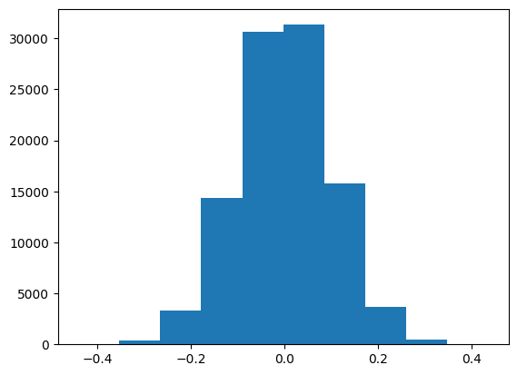

# Learn-Numpy

### Everything you need to know about Numpy!

If you are venturing into data science or machine learning, you will most likely encounter the Python library NumPy. NumPy is an open-source library that is widely used in scientific computing and data analysis. It provides robust support for multi-dimensional arrays and matrices, and a wide range of mathematical functions to operate on them. Here are some of the most commonly used functions that can help you get started with NumPy.

## Creating arrays

Arrays are at the core of NumPy. Creating arrays in NumPy is straightforward, and there are several ways to do it. The most common way of creating arrays is by using the `array()` function, which takes in a list or tuple and returns an array. For example, to create a 1-dimensional array with three elements, you can use the following code:

```python

 import numpy as np
 my_array = np.array([1, 2, 3])

```

If you want to create a two-dimensional array with three rows and two columns, you can use a nested list:

```python

 my_2d_array = np.array([[1, 2], [3, 4], [5, 6]])

```

## Mathematical operations

NumPy provides a wide range of mathematical functions to operate on arrays. These functions are optimized for numerical operations and are much faster than their Python counterparts. Some of the most commonly used mathematical functions include:

- `np.add()`: Adds two arrays element-wise
- `np.subtract()`: Subtracts two arrays element-wise
- `np.multiply()`: Multiplies two arrays element-wise
- `np.divide()`: Divides two arrays element-wise

Here is an example of how to use the `add()` function to add two arrays:

```python

 a = np.array([1, 2, 3])
 b = np.array([4, 5, 6])
 c = np.add(a, b)

 print(c) 

 # output: 
 [5, 7, 9]

```

## Array manipulation

NumPy provides several functions for manipulating arrays. Here are some commonly used functions:

- `np.reshape()`: Reshapes an array into a new shape
- `np.concatenate()`: Joins two or more arrays
- `np.transpose()`: Transposes an array

Here is an example of how to use the `reshape()` function to reshape an array:

```python

 a = np.array([1, 2, 3, 4, 5, 6])
 b = np.reshape(a, (2, 3))
 print(b) 

 # output: 
 [[1, 2, 3], 
  [4, 5, 6]]
 
```

Here is an example of how to use the `concatenate()` function to join two arrays:

```python

 a = np.array([1, 2, 3])
 b = np.array([4, 5, 6])
 c = np.concatenate((a, b))

 print(c) 
 # output: 
 [1, 2, 3, 4, 5, 6]

```

Here is an example of how to use the `transpose()` function to transpose an array:

```python

 a = np.array([[1, 2], [3, 4], [5, 6]])
 b = np.transpose(a)
 print(b)

 # output: 
 [[1, 3, 5], 
  [2, 4, 6]]

```
## Set Operations

NumPy provides functions for performing set operations like union and intersect:

- `np.union1d()`: Creates a array of unique elements in two arrays.
- `np.intersect1d()`: Finds the intersection between two array.

Here is an example for both

```python

  a = np.array([1, 2, 0])
  b = np.array([1, 3, 4])

  print(np.union1d(a, b))

  # output:
  [0, 1, 2, 3, 4]

  print(np.intersect1d(a, b))

  # output:
  [1]

```
## Numpy Datetime

NumPy provides functions for finding and manipulating dates:

- `np.datetime64()`: We can get the date in any format.
- `np.is_busday()`: To find the business day. By default, it considers saturday and sunday as not business days, however, it is customizable.

Here is an example for both

```python

  today = np.datetime64("today")
  print(today)

  # output:
  2023-03-19

```
```python

  print(np.is_busday(np.datetime64('today')))

  # output:
  False

```
```python

  #How to generate a range of dates:
  np.arange('2023-01', '2023-02', dtype='datetime64[W]') #W - Week, replace with D

  # output:
  ['2022-12-29' '2023-01-05' '2023-01-12' '2023-01-19']

```
## Creating Distribution

NumPy provides several functions for creating distribution. Here are some commonly used distribution functions:

- `np.random.normal()`: Creates a normal distribution based on mu(mean) and sigma(variance)
- `np.random.uniform()`: Creates a uniform distribution
- `np.random.binomial`: Creates a binomial distribution based on n(trials) and p(probability).

Here is an example of how to use the `normal()` function to create a normal distribution using an array:

```python

  import numpy as np
  import matplotlib.pyplot as plt

  mu, sigma = 0, 0.1 #mean and variance
  z = np.random.normal(mu, sigma, 100000)
  plt.hist(z)
  plt.show()

```


Here is an example of how to use the `uniform()` function to create a uniform distribution using an array:

```python

  z = np.random.uniform(0, 10, 100000)
  plt.hist(z)
  plt.show()

```


Here is an example of how to use the `binomial()` function to create a binomial distribution using an array:

```python

  n, p = 10, 0.5 
  z = np.random.binomial(n, p, 1000000)
  plt.hist(z)
  plt.show()

```


## Conclusion

These are just a few of the many functions that NumPy provides. With these functions, you can perform a wide range of operations on arrays and matrices. NumPy is a powerful library that can help you streamline your data analysis and machine learning workflows.

Don't forget to subscribe to our newsletter to stay up-to-date with the latest news and updates on data science tools and techniques!

